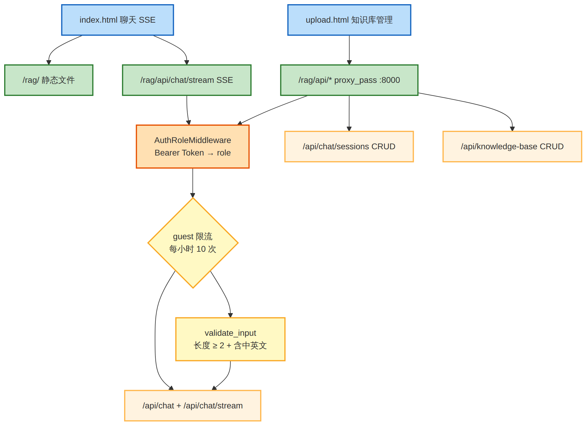

# RAG Smart Customer Service

基于 **LangChain Function Calling** 的中文 RAG 智能客服系统。支持本地知识库检索、联网搜索、数学计算，提供静态前端 + FastAPI 后端，Docker 容器化部署。

## 技术栈

| 层 | 技术 |
|------|------|
| Agent 框架 | LangChain（`bind_tools` + 自定义 Agent 循环） |
| 对话模型 | `qwen3.5-flash`（DashScope OpenAI 兼容接口） |
| 嵌入模型 | `BAAI/bge-large-zh-v1.5`（硅基流动） |
| 向量数据库 | Chroma（本地持久化） |
| 文档解析 | PyMuPDF（PDF）、python-docx（DOCX）、RapidOCR（图片 OCR，ONNX Runtime） |
| 前端 | 静态 HTML/CSS/JS（nginx 直接 serving） |
| API | FastAPI + uvicorn |
| 流式响应 | SSE（Server-Sent Events） |
| Markdown 渲染 | marked.js + DOMPurify（前端） |
| 认证 | Bearer Token 双角色认证（admin/guest） |
| 容器化 | Docker + docker-compose |

## 功能

- **多格式知识库** — 上传 TXT / MD / PDF / DOCX / 图片到知识库，自动分割 + 向量化 + MD5 去重
- **Function Calling Agent** — 三个工具：
  - `knowledge_base_search` — 从本地知识库检索相关内容
  - `web_search` — 联网搜索（百度新闻 + Bing 备用）
  - `calculator` — 安全数学计算
- **流式打字机效果** — SSE 实时流式输出，token 逐字渲染
- **Markdown 渲染** — 表格、代码块、列表等格式正确展示
- **多轮对话记忆** — 对话轮次截断（保留最近 5 轮），刷新页面后自动加载历史
- **会话管理** — 侧边栏对话列表，支持新建/切换/重命名/删除，LLM 自动生成标题
- **Token 用量追踪** — 每次请求统计输入/输出 token，按会话持久化，前端实时显示
- **输入内容前置拦截** — 长度不足、纯标点、无实质内容的输入自动拒答
- **安全拒答** — 违法违规/执行动作/工具无结果时友好拒答
- **用户认证** — Bearer Token 双角色认证（admin/guest），数据完全隔离
- **RESTful API** — FastAPI 提供聊天、流式、历史、知识库接口
- **Docker 部署** — 源码卷挂载 + uvicorn `--reload` 热重载，代码改动秒级生效
- **结果类测试体系** — API 冒烟 / Locust 压测 / RAG 参数遍历 / 生产巡检

## 架构概览



> 完整架构文档（分层架构 + 模块依赖 + 数据流 + 部署拓扑）→ [docs/ARCHITECTURE.md](docs/ARCHITECTURE.md)

## 快速开始

### 前置条件

```bash
# 安装依赖
cd RAG
pip install -r requirements.txt

# 设置阿里云 DashScope API Key
export DASHSCOPE_API_KEY=sk-xxxxxx
```

### Docker 部署（推荐）

```bash
cd docker
docker-compose up --build
```

### 本地开发

```bash
python -m uvicorn api.server:app --reload
```

## 项目结构

```
RAG/
├── api/                   # FastAPI 后端
│   ├── server.py          # 入口（含 Auth 中间件）
│   ├── chat.py            # 聊天 API（含流式 + 历史端点 + 输入校验）
│   ├── knowledge_base.py  # 知识库 API
│   ├── auth.py            # 角色认证
│   ├── rate_limit.py      # 访客限流
│   ├── middleware.py       # 认证中间件
│   └── deps.py            # 角色服务工厂
├── docker/                # 容器配置
│   ├── Dockerfile
│   ├── docker-compose.yml
│   └── .env               # 环境变量（含测试配置）
├── web/                   # 生产环境静态前端
│   ├── index.html         # 聊天界面（含 Token 统计栏）
│   └── upload.html        # 知识库管理
├── tests/                 # 结果类测试
│   ├── test_api.py        # API 冒烟（全端点 + 认证 + 限流）
│   ├── locustfile.py      # Locust 压测
│   ├── test_rag_precision_grid.py  # RAG 参数遍历
│   ├── prod_verify.sh     # 生产环境巡检
│   └── data/              # 测试文档
├── docs/                  # 项目文档
│   ├── ARCHITECTURE.md    # 架构文档（含 7 张架构图）
│   └── diagrams/          # Mermaid 源文件 + PNG 导出
├── data/                  # 运行时数据（git ignored）
│   ├── chroma_db/         # 向量数据库（admin/guest 独立）
│   ├── chat_history/      # 聊天记录 + 会话元数据（admin/guest 独立）
│   ├── md5_*.text         # MD5 去重记录（admin/guest 独立）
│   └── rate_limit.json    # 访客限流计数
├── rag_agent.py           # Agent 核心（Function Calling 循环 + 流式生成 + Token 追踪）
├── knowledge_base.py      # 知识库服务（分割 / 嵌入 / 去重，北京时间时间戳）
├── vector_stores.py       # Chroma 检索封装
├── file_parser.py         # 多格式文档解析器（支持 TXT/MD/PDF/DOCX/图片）
├── file_history_store.py  # 聊天历史存储（文件 + 会话元数据 + Token 累计）
├── evaluation.py          # RAG 评估（Hit Rate / MRR / 延迟）
├── config_data.py         # 全局配置（含 admin_token/guest_token + System Prompt）
├── bug_and_fix.md         # Bug 修复记录
├── TESTING.md             # 6 层结果类测试体系指南
├── requirements.txt       # 完整依赖（含 streamlit/pytest，本地开发用）
└── requirements-prod.txt  # 生产依赖（Docker 用，精简版）
```

## API 端点

所有 API 端点需要 `Authorization: Bearer <password>` 请求头（密码在 `docker/.env` 中配置）。
- **admin**（`admin2026`）：完全访问，不限次数
- **guest**（`guest123`）：功能完全一致，每小时 10 次 IP 限流，数据与 admin 隔离

| 方法 | 路径 | 说明 |
|------|------|------|
| `POST` | `/api/chat` | 发送消息（非流式，含累计 token_usage） |
| `POST` | `/api/chat/stream` | 发送消息（SSE 流式，含累计 token_usage） |
| `GET` | `/api/chat/history?session_id=` | 获取会话聊天历史 |
| `GET` | `/api/chat/sessions` | 列出所有会话 |
| `PUT` | `/api/chat/sessions/{session_id}` | 重命名会话 |
| `DELETE` | `/api/chat/sessions/{session_id}` | 删除会话 |
| `POST` | `/api/knowledge-base/upload` | 上传文档到知识库 |
| `GET` | `/api/knowledge-base/documents` | 列出知识库所有文档 |
| `DELETE` | `/api/knowledge-base/documents/{source}` | 删除指定来源的文档 |

## 测试

6 层结果类测试体系，详见 [TESTING.md](TESTING.md)：

```bash
# 离线评估（检索质量，无需 API Key）
python -m pytest tests/test_rag_retriever.py -v -s

# 在线评估（Agent 行为，需 API Key）
python -m pytest tests/test_rag_agent.py -v -s

# API 冒烟测试（全端点 + 认证 + 限流）
python -m pytest tests/test_api.py -v

# Locust 压测（Mock 模式 0 Token 消耗）
RAG_MOCK_LLM=1 RAG_LOCUST_TOKEN=admin2026 locust -f tests/locustfile.py \
  --host=http://localhost:8000 --headless -u 5 -r 1 --run-time 1m

# 参数调优
python tuning/tune_chunk_params.py --fast
python tuning/tune_retriever_k.py --phase offline

# 生产环境巡检
bash tests/prod_verify.sh
```

## 生产部署

项目已部署在 `<your-domain.com>/rag`，通过 Docker + nginx 反向代理运行。

```
浏览器 ──https──→ nginx (<your-domain.com>)
                   │
                   ├── /rag/               → web/ 静态前端（聊天 + 知识库管理）
                   ├── /rag/api/chat/stream→ SSE 流式端点（proxy_buffering off）
                   └── /rag/api/*          → FastAPI Docker 容器 (127.0.0.1:8000)
```

### 服务器配置

| 组件 | 位置 |
|------|------|
| 静态前端 | `web/`（复制到 nginx serving 目录） |
| Docker 镜像 | `docker-rag-agent:latest` (~4 GB) |
| systemd 服务 | `rag-agent.service` |
| API Key 配置 | `/home/admin/my_projects/RAG/docker/.env` |
| nginx 配置 | `/etc/nginx/sites-available/&lt;project&gt;` |

### 常用运维命令

```bash
# 启动 / 停止 / 重启
sudo systemctl start rag-agent.service
sudo systemctl stop rag-agent.service
sudo systemctl restart rag-agent.service   # 代码更新后

# 查看日志
sudo journalctl -u rag-agent.service -f
sudo docker compose -f /home/admin/my_projects/RAG/docker/docker-compose.yml logs -f

# 更新代码（源码已卷挂载，restart 即可，无需重建）
cd ~/my_projects/RAG && git pull
sudo docker compose -f /home/admin/my_projects/RAG/docker/docker-compose.yml restart

# 重建镜像（仅 requirements.txt 或 Dockerfile 变更时需要）
cd ~/my_projects/RAG/docker
sudo docker compose build
sudo docker compose up -d
```

### Docker 构建说明

- Dockerfile 已将 apt 源替换为阿里云镜像，pip 使用阿里云 PyPI 镜像
- 安装 `build-essential`（`stringzilla` 等包需要 C 编译）
- 安装 `libgl1`、`libglib2.0-0`、`libxcb1`（OpenCV/RapidOCR 运行时依赖）
- 生产环境使用 `requirements-prod.txt`（不含 streamlit/pytest）
- 容器内存限制 1GB（`docker-compose.yml` 中 `mem_limit: 1g`）
- **pip 层缓存**：只要 `requirements-prod.txt` 不变，pip 安装层永久缓存。不要主动运行 `docker builder prune`
- **源码卷挂载**：`docker-compose.yml` 已将 Python 源码目录挂载进容器，配合 uvicorn `--reload`，代码改动无需重建镜像（仅重启 ~2 秒）

### 环境变量

存储在 `docker/.env`，docker-compose 自动读取：
- `DASHSCOPE_API_KEY`：阿里云 DashScope API Key（对话模型）
- `SILICONFLOW_API_KEY`：硅基流动 API Key（嵌入模型）
- `ADMIN_TOKEN`：管理员密码
- `GUEST_TOKEN`：访客密码
- `RAG_PROD_URL`：冒烟测试生产地址
- `RAG_TEST_TOKEN`：冒烟测试 Bearer token

### 访问地址

| 页面 | URL |
|------|-----|
| 聊天界面 | `https://<your-domain.com>/rag/` |
| 知识库管理 | `https://<your-domain.com>/rag/upload.html` |
| 导航页 | `https://<your-domain.com>/` |
| API（内部） | `http://127.0.0.1:8000` |

## License

MIT
