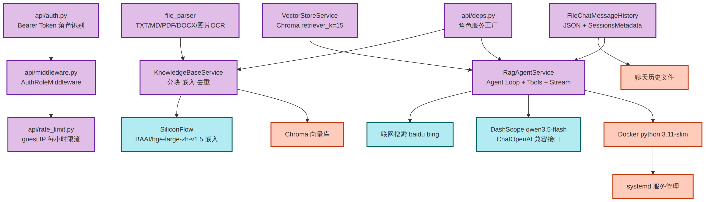
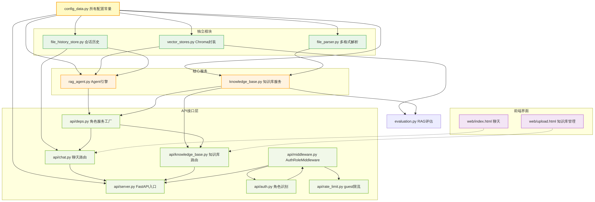
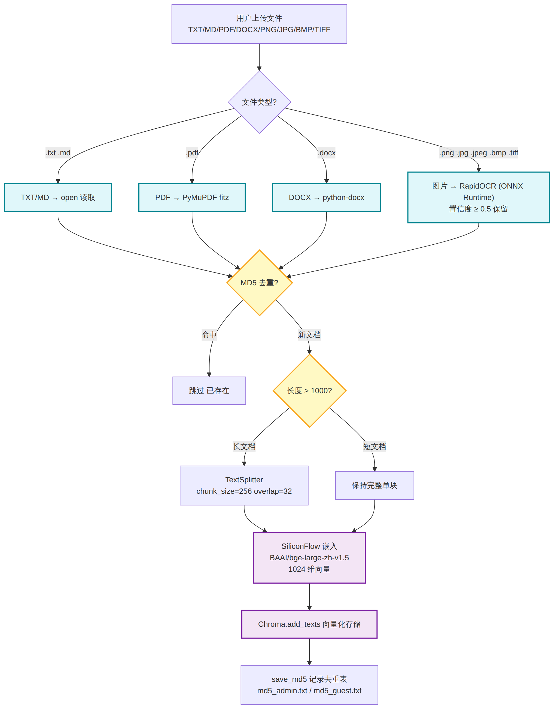
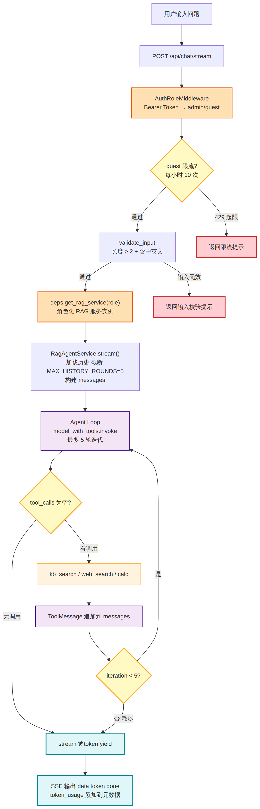
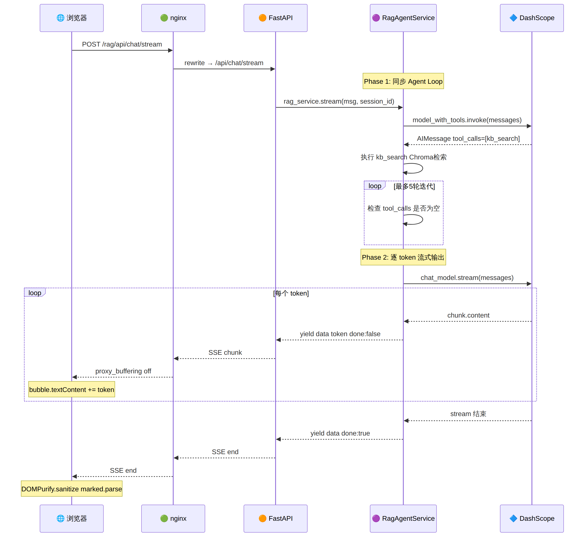
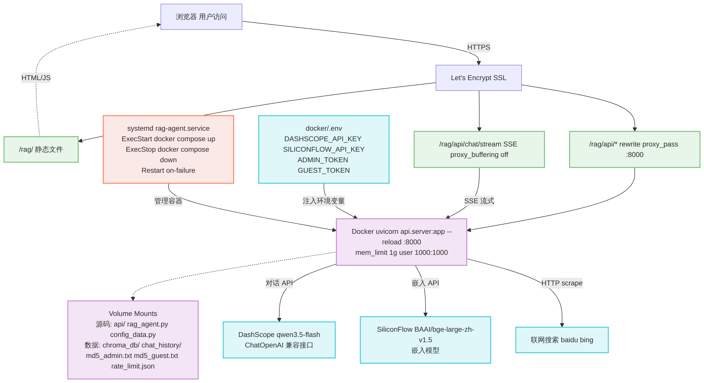

# RAG 系统架构文档

> 本文档详细描述系统的分层架构、模块依赖、核心数据流和部署拓扑。

---

## 1. 前端 + 反代 + API 层

用户请求从浏览器出发，经 nginx 反向代理到达 FastAPI 后端。


**三层流转：**

| 层 | 组件 | 职责 |
|----|------|------|
| 前端展示 | `index.html` 聊天界面（SSE 流式消费）<br>`upload.html` 知识库管理界面 | 静态 HTML，nginx 直接 serve |
| nginx 反代 | `/rag/` → 静态文件<br>`/rag/api/*` → proxy_pass :8000<br>`/rag/api/chat/stream` → SSE 专用（proxy_buffering off） | SSL 终结 + 子路径路由 |
| FastAPI 接口 | 聊天接口（流式/非流式）<br>会话 CRUD<br>知识库 CRUD<br>Auth Middleware（Bearer Token） | uvicorn 运行在 Docker 容器内 |

---

## 2. 服务层 + 基础设施 + 外部服务

核心业务逻辑、数据存储和外部 API 调用。



**服务层核心组件：**

| 组件 | 职责 |
|------|------|
| `RagAgentService` | Agent Loop（手写循环，非 LangChain AgentExecutor）+ 两阶段流式生成 |
| `KnowledgeBaseService` | 文档分块 → MD5 去重 → 向量化 → Chroma 存储 |
| `file_parser.py` | 多格式解析：TXT/MD（open）、PDF（PyMuPDF）、DOCX（python-docx）、图片（RapidOCR，ONNX Runtime） |
| `FileChatMessageHistory` | JSON 文件持久化 + `SessionsMetadata` 会话元数据管理 |
| `VectorStoreService` | Chroma 检索封装，`get_retriever(k=15)` |
| `api/deps.py` | 角色服务工厂 — 按 admin/guest 返回独立的 RAG / KB 服务实例 |
| `api/middleware.py` | `AuthRoleMiddleware` — Bearer Token → 角色识别 + 注入 `request.state.role` |
| `api/auth.py` | 角色认证 — `ADMIN_TOKEN` / `GUEST_TOKEN` 环境变量匹配 |
| `api/rate_limit.py` | guest IP 每小时限流（JSON 文件计数，10 次/小时） |

**基础设施：**

- **Docker** — `python:3.11-slim` + uvicorn `--reload`，mem_limit=1g
- **Chroma** — 本地向量数据库，`./data/chroma_db/{admin,guest}/`（角色化隔离）
- **聊天历史** — JSON 文件，`./data/chat_history/{admin,guest}/`（角色化隔离）
- **systemd** — `rag-agent.service`，管理 Docker 容器生命周期

**外部服务：**

- **DashScope** — `qwen3.5-flash`（对话模型，ChatOpenAI 兼容接口）
- **SiliconFlow** — `BAAI/bge-large-zh-v1.5`（嵌入模型，1024 维向量）
- **联网搜索** — 百度新闻优先 + Bing 备用（爬虫解析，无官方 API）

---

## 3. 模块依赖关系

所有 Python 模块的 import 依赖链。`config_data.py` 是叶子节点，被所有其他模块引用。



**依赖层次（自上而下）：**

1. **config_data.py** — 全局配置常量（模型名、路径、阈值、auth_token）
2. **独立模块** — `file_parser.py`、`file_history_store.py`、`vector_stores.py`（无反向依赖）
3. **核心服务** — `knowledge_base.py`、`rag_agent.py`（消费独立模块）
4. **API 接口层** — `api/server.py`（入口）、`api/middleware.py`（认证中间件）、`api/auth.py`（角色识别）、`api/rate_limit.py`（guest 限流）、`api/deps.py`（角色服务工厂）、`api/chat.py`（聊天路由）、`api/knowledge_base.py`（知识库路由）
5. **前端界面** — `web/index.html`（聊天）、`web/upload.html`（知识库管理）

---

## 4. 知识库导入流程

文件从上传到存入向量库的完整链路。



**关键设计：**

- **MD5 去重** — 文档级去重（非块级），整份文件的 MD5 与 `md5_admin.txt` / `md5_guest.txt` 比对
- **分块阈值** — `len > 1000` 字符才触发 `TextSplitter`（chunk_size=256, overlap=32），短文档保持完整
- **嵌入模型** — SiliconFlow `BAAI/bge-large-zh-v1.5`，1024 维向量
- **图片 OCR** — 支持 PNG/JPG/JPEG/BMP/TIFF，使用 RapidOCR（ONNX Runtime），置信度 ≥ 0.5 保留

---

## 5. Agent 问答流程

用户提问到获得回答的完整 Agent 循环。



**循环逻辑：**

```
用户输入 → AuthRoleMiddleware(Bearer Token → role)
  → guest 限流检查(每小时10次)
  → validate_input(长度≥2 + 含中英文)
  → deps.get_rag_service(role) 角色化服务实例
  → 构建 messages(截断最近5轮历史) → Agent Loop:
    model_with_tools.invoke(messages)
    ├── 有 tool_calls → 执行工具 → ToolMessage 追加 → 继续循环
    ├── 无 tool_calls → 返回最终回答（跳出）
    └── 达到 max_iterations(5) → fallback 强制生成（跳出）
→ stream() 逐 token 输出 → SSE 推送到前端
→ token_usage 累加到会话元数据（持久化）
```

**三个工具：**

| 工具 | 触发条件 | 实现 |
|------|----------|------|
| `knowledge_base_search` | 默认优先 | Chroma 相似度检索 k=15，按分数分层（高分/中分/丢弃） |
| `web_search` | 知识库无结果或需实时信息 | 百度新闻 + Bing 爬虫 |
| `calculator` | 数学计算需求 | `ast.parse` + 白名单 eval |

---

## 6. SSE 端到端时序图

从浏览器到 DashScope 的完整流式传输链路。



**两阶段设计：**

1. **Phase 1（同步）** — Agent Loop 执行多轮 tool_calls，前端显示"思考中"
2. **Phase 2（流式）** — `chat_model.stream()` 逐 token yield，前端实时渲染

**关键配置：**

- nginx: `proxy_buffering off` + `proxy_cache off` + `proxy_read_timeout 300s`
- 后端: `X-Accel-Buffering: no` 响应头
- 前端: Streams API (`resp.body.getReader()`) 消费 SSE，流结束后 `DOMPurify.sanitize(marked.parse())` 渲染 Markdown

---

## 7. 生产部署架构

从 Internet 到 Docker 容器的完整部署拓扑。



**部署链路：**

```
Internet → HTTPS → nginx (Let's Encrypt SSL)
  ├── /rag/              → alias 静态文件 (/var/www/yellowduck/rag/)
  ├── /rag/api/*         → rewrite + proxy_pass → Docker :8000
  └── /rag/api/chat/stream → SSE 专用（proxy_buffering off）

Docker 容器 (python:3.11-slim)
  ├── uvicorn api.server:app --reload
  ├── Volume: 源码 (热重载) + data/ (持久化)
  │   ├── 源码: api/ rag_agent.py config_data.py file_parser.py ...
  │   └── 数据: chroma_db/{admin,guest}/ chat_history/{admin,guest}/ md5_admin.txt md5_guest.txt rate_limit.json
  └── mem_limit=1g, user=1000:1000

systemd rag-agent.service
  ├── ExecStart: docker compose up -d --build
  ├── ExecStop: docker compose down
  └── Restart: on-failure
```

**热重载机制：**

- 改 Python 代码 → `docker compose restart`（~2 秒生效）
- 改前端 HTML → 直接保存（nginx 直接 serve，0 秒生效）
- 只有 `requirements.txt` 或 `Dockerfile` 变更才需重建镜像
