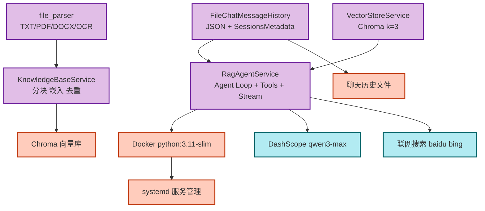

# 服务层 + 基础设施 + 外部服务

```mermaid
flowchart TD
  agent["RagAgentService\nAgent Loop + Tools + Stream"]
  kb_svc["KnowledgeBaseService\n分块 嵌入 去重"]
  parser["file_parser\nTXT/PDF/DOCX/OCR"]
  history["FileChatMessageHistory\nJSON + SessionsMetadata"]
  vs["VectorStoreService\nChroma k=3"]

  docker["Docker python:3.11-slim"]
  chroma["Chroma 向量库"]
  chat_f["聊天历史文件"]
  systemd_s["systemd 服务管理"]

  dash["DashScope qwen3-max"]
  search["联网搜索 baidu bing"]

  agent --> docker
  agent --> dash
  agent --> search
  kb_svc --> chroma
  parser --> kb_svc
  history --> agent
  vs --> agent
  history --> chat_f
  docker --> systemd_s

  classDef svc fill:#E1BEE7,stroke:#6A1B9A,stroke-width:2px
  classDef infra fill:#FFCCBC,stroke:#BF360C,stroke-width:2px
  classDef ext fill:#B2EBF2,stroke:#006064,stroke-width:2px
  class agent,kb_svc,parser,history,vs svc
  class docker,chroma,chat_f,systemd_s infra
  class dash,search ext
```
