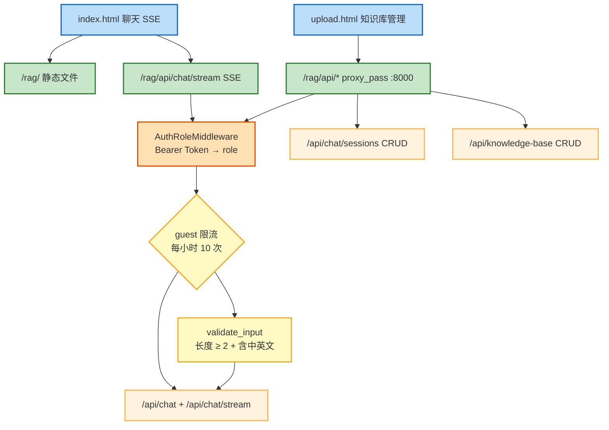

# 前端 + 反代 + API 层

```mermaid
flowchart TD
  index["index.html 聊天 SSE"]
  upload_p["upload.html 知识库管理"]

  nginx_s["/rag/ 静态文件"]
  nginx_api["/rag/api/* proxy_pass :8000"]
  nginx_sse["/rag/api/chat/stream SSE"]

  mw["AuthRoleMiddleware\nBearer Token → role"]
  rl{"guest 限流\n每小时 10 次"}
  validate["validate_input\n长度 ≥ 2 + 含中英文"]
  chat["/api/chat + /api/chat/stream"]
  sessions["/api/chat/sessions CRUD"]
  kb_api["/api/knowledge-base CRUD"]

  index --> nginx_s
  index --> nginx_sse
  upload_p --> nginx_api

  nginx_sse --> mw
  nginx_api --> mw
  mw --> rl
  rl --> validate
  rl --> chat
  validate --> chat
  nginx_api --> sessions & kb_api

  classDef ui fill:#BBDEFB,stroke:#1565C0,stroke-width:2px
  classDef proxy fill:#C8E6C9,stroke:#2E7D32,stroke-width:2px
  classDef auth fill:#FFE0B2,stroke:#E65100,stroke-width:2px
  classDef api fill:#FFF3E0,stroke:#FFB74D,stroke-width:2px
  classDef decision fill:#FFF9C4,stroke:#F9A825,stroke-width:2px
  class index,upload_p ui
  class nginx_s,nginx_api,nginx_sse proxy
  class mw auth
  class chat,sessions,kb_api api
  class rl,validate decision
```
