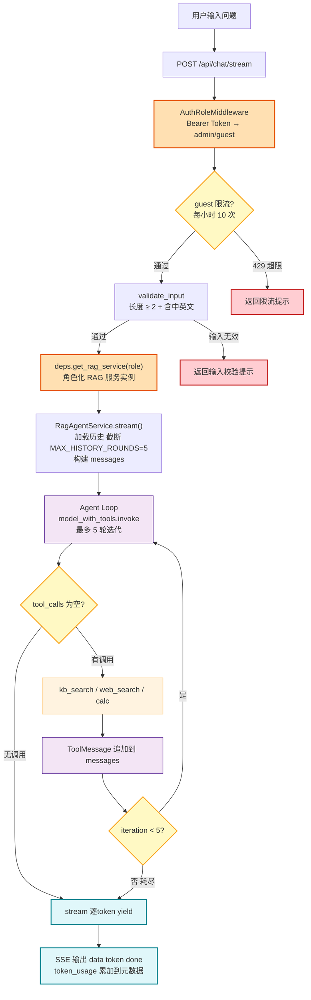

# Agent 问答流程

```mermaid
flowchart TD
  U["用户输入问题"]

  A["POST /api/chat/stream"]

  B["AuthRoleMiddleware\nBearer Token → admin/guest"]

  RL{"guest 限流?\n每小时 10 次"}

  VI["validate_input\n长度 ≥ 2 + 含中英文"]

  RAG["deps.get_rag_service(role)\n角色化 RAG 服务实例"]

  C["RagAgentService.stream()\n加载历史 截断 MAX_HISTORY_ROUNDS=5\n构建 messages"]

  D["Agent Loop\nmodel_with_tools.invoke\n最多 5 轮迭代"]

  E{"tool_calls 为空?"}

  F["kb_search / web_search / calc"]

  G["ToolMessage 追加到 messages"]

  H{"iteration < 5?"}

  I["stream 逐token yield"]

  J["SSE 输出 data token done\ntoken_usage 累加到元数据"]

  U --> A --> B --> RL
  RL -->|"429 超限"| REJECT["返回限流提示"]
  RL -->|"通过"| VI
  VI -->|"输入无效"| REJECT2["返回输入校验提示"]
  VI -->|"通过"| RAG --> C --> D --> E
  E -->|"有调用"| F --> G --> H
  H -->|"是"| D
  E -->|"无调用"| I
  H -->|"否 耗尽"| I
  I --> J

  classDef decision fill:#FFF9C4,stroke:#F9A825,stroke-width:2px
  classDef stream fill:#E0F7FA,stroke:#00838F,stroke-width:2px
  classDef loop fill:#F3E5F5,stroke:#4A148C
  classDef tool fill:#FFF3E0,stroke:#FFB74D
  classDef auth fill:#FFE0B2,stroke:#E65100,stroke-width:2px
  classDef reject fill:#FFCDD2,stroke:#C62828,stroke-width:2px
  class E,H,RL decision
  class I,J stream
  class D,G loop
  class F tool
  class B,RAG auth
  class REJECT,REJECT2 reject
```
