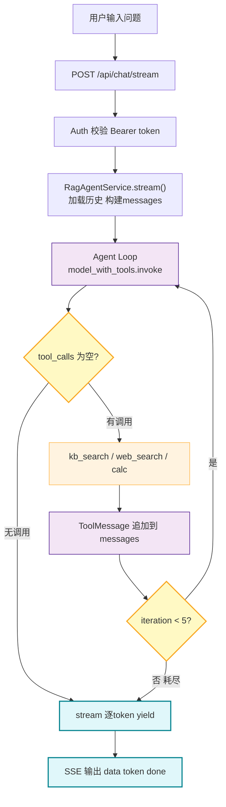

# Agent 问答流程

```mermaid
flowchart TD
  U["用户输入问题"]

  A["POST /api/chat/stream"]

  B["Auth 校验 Bearer token"]

  C["RagAgentService.stream()\n加载历史 构建messages"]

  D["Agent Loop\nmodel_with_tools.invoke"]

  E{"tool_calls 为空?"}

  F["kb_search / web_search / calc"]

  G["ToolMessage 追加到 messages"]

  H{"iteration < 5?"}

  I["stream 逐token yield"]

  J["SSE 输出 data token done"]

  U --> A --> B --> C --> D --> E
  E -->|"有调用"| F --> G --> H
  H -->|"是"| D
  E -->|"无调用"| I
  H -->|"否 耗尽"| I
  I --> J

  classDef decision fill:#FFF9C4,stroke:#F9A825,stroke-width:2px
  classDef stream fill:#E0F7FA,stroke:#00838F,stroke-width:2px
  classDef loop fill:#F3E5F5,stroke:#4A148C
  classDef tool fill:#FFF3E0,stroke:#FFB74D
  class E,H decision
  class I,J stream
  class D,G loop
  class F tool
```
