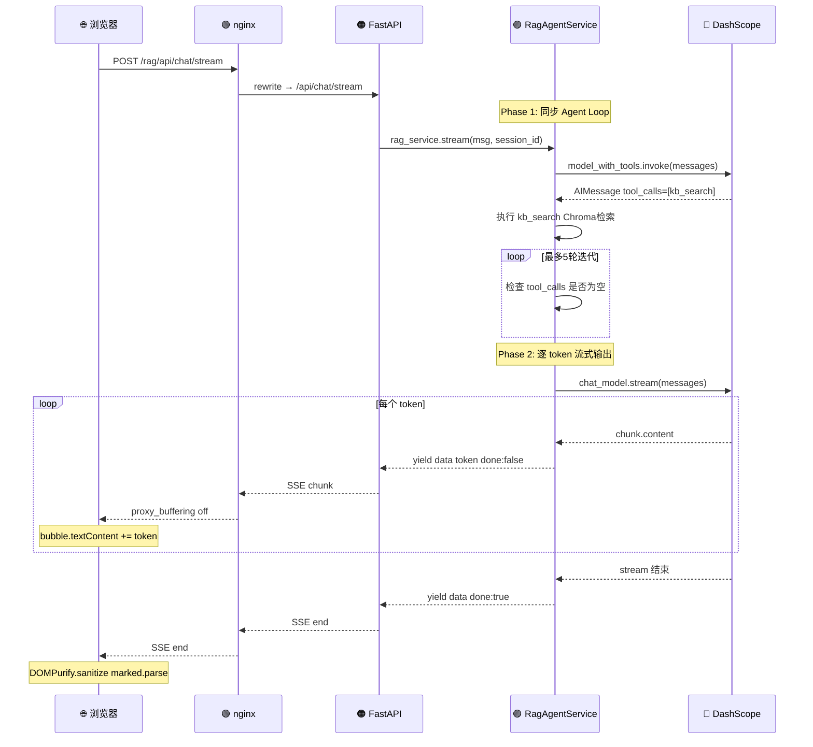

# SSE 端到端时序图

> 浏览器 → nginx → FastAPI → Agent → DashScope 全链路流式传输

```mermaid
sequenceDiagram
  participant B as 🌐 浏览器
  participant N as 🟢 nginx
  participant A as 🟠 FastAPI
  participant R as 🟣 RagAgentService
  participant L as 🔷 DashScope

  B->>N: POST /rag/api/chat/stream
  N->>A: rewrite → /api/chat/stream

  Note over R: Phase 1: 同步 Agent Loop

  A->>R: rag_service.stream(msg, session_id)
  R->>L: model_with_tools.invoke(messages)
  L-->>R: AIMessage tool_calls=[kb_search]
  R->>R: 执行 kb_search Chroma检索

  loop 最多5轮迭代
    R->>R: 检查 tool_calls 是否为空
  end

  Note over R: Phase 2: 逐 token 流式输出

  R->>L: chat_model.stream(messages)
  loop 每个 token
    L-->>R: chunk.content
    R-->>A: yield data token done:false
    A-->>N: SSE chunk
    N-->>B: proxy_buffering off
    Note over B: bubble.textContent += token
  end

  L-->>R: stream 结束
  R-->>A: yield data done:true
  A-->>N: SSE end
  N-->>B: SSE end

  Note over B: DOMPurify.sanitize marked.parse
```
