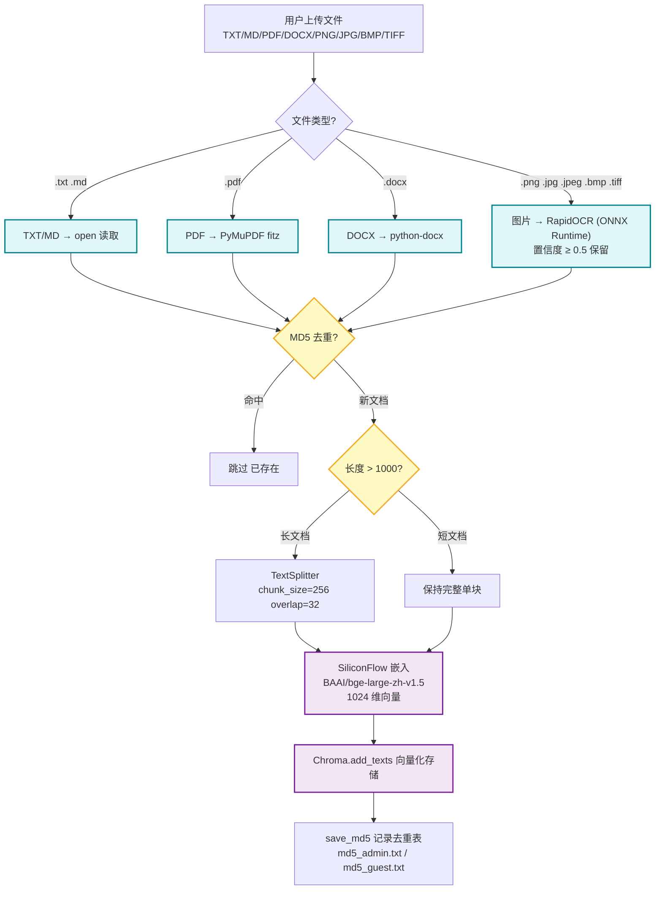

# 知识库导入流程

```mermaid
flowchart TD
  A["用户上传文件\nTXT/MD/PDF/DOCX/PNG/JPG/BMP/TIFF"]

  B{"文件类型?"}

  B_txt["TXT/MD → open 读取"]
  B_pdf["PDF → PyMuPDF fitz"]
  B_docx["DOCX → python-docx"]
  B_img["图片 → RapidOCR (ONNX Runtime)\n置信度 ≥ 0.5 保留"]

  C{"MD5 去重?"}

  D["跳过 已存在"]

  E{"长度 > 1000?"}

  F["TextSplitter\nchunk_size=256 overlap=32"]

  G["保持完整单块"]

  H["SiliconFlow 嵌入\nBAAI/bge-large-zh-v1.5\n1024 维向量"]

  I["Chroma.add_texts 向量化存储"]

  J["save_md5 记录去重表\nmd5_admin.txt / md5_guest.txt"]

  A --> B
  B -->|".txt .md"| B_txt
  B -->|".pdf"| B_pdf
  B -->|".docx"| B_docx
  B -->|".png .jpg .jpeg .bmp .tiff"| B_img
  B_txt --> C
  B_pdf --> C
  B_docx --> C
  B_img --> C
  C -->|"命中"| D
  C -->|"新文档"| E
  E -->|"长文档"| F --> H
  E -->|"短文档"| G --> H
  H --> I --> J

  classDef decision fill:#FFF9C4,stroke:#F9A825,stroke-width:2px
  classDef embed fill:#F3E5F5,stroke:#7B1FA2,stroke-width:2px
  classDef parse fill:#E0F7FA,stroke:#00838F,stroke-width:2px
  class C,E decision
  class H,I embed
  class B_txt,B_pdf,B_docx,B_img parse
```
