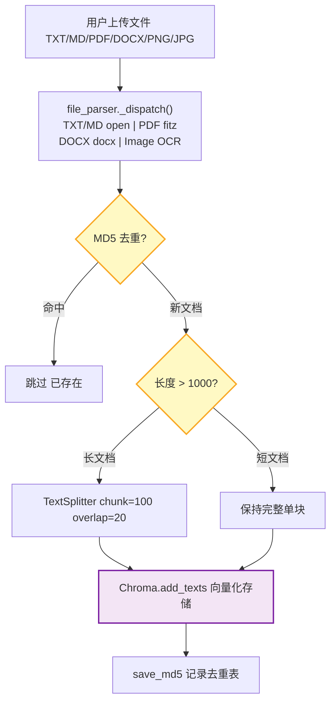

# 知识库导入流程

```mermaid
flowchart TD
  A["用户上传文件 TXT/MD/PDF/DOCX/PNG/JPG"]

  B["file_parser._dispatch()\nTXT/MD open | PDF fitz\nDOCX docx | Image OCR"]

  C{"MD5 去重?"}

  D["跳过 已存在"]

  E{"长度 > 1000?"}

  F["TextSplitter chunk=100 overlap=20"]

  G["保持完整单块"]

  H["Chroma.add_texts 向量化存储"]

  I["save_md5 记录去重表"]

  A --> B --> C
  C -->|"命中"| D
  C -->|"新文档"| E
  E -->|"长文档"| F --> H
  E -->|"短文档"| G --> H
  H --> I

  classDef decision fill:#FFF9C4,stroke:#F9A825,stroke-width:2px
  classDef embed fill:#F3E5F5,stroke:#7B1FA2,stroke-width:2px
  class C,E decision
  class H embed
```
