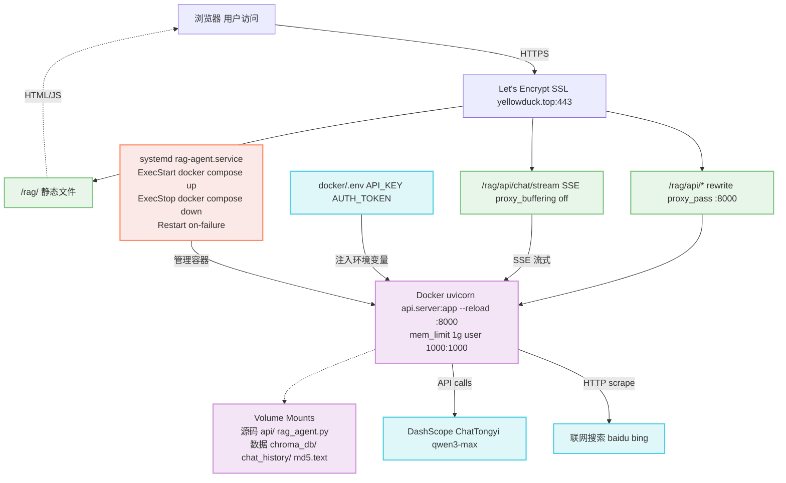

# RAG 生产部署架构

```mermaid
flowchart TD
  browser["浏览器 用户访问"]

  ssl["Let's Encrypt SSL yellowduck.top:443"]

  nginx1["/rag/ 静态文件"]
  nginx2["/rag/api/* rewrite proxy_pass :8000"]
  nginx3["/rag/api/chat/stream SSE proxy_buffering off"]

  browser -->|"HTTPS"| ssl
  ssl --> nginx1 & nginx2 & nginx3
  nginx1 -.->|"HTML/JS"| browser

  uvicorn["Docker uvicorn api.server:app --reload :8000\nmem_limit 1g user 1000:1000"]

  nginx2 --> uvicorn
  nginx3 -->|"SSE 流式"| uvicorn

  mounts["Volume Mounts\n源码 api/ rag_agent.py\n数据 chroma_db/ chat_history/ md5.text"]

  uvicorn -.-> mounts

  dash["DashScope ChatTongyi qwen3-max"]
  ws["联网搜索 baidu bing"]
  env["docker/.env API_KEY AUTH_TOKEN"]

  uvicorn -->|"API calls"| dash
  uvicorn -->|"HTTP scrape"| ws
  env -->|"注入环境变量"| uvicorn

  systemd["systemd rag-agent.service\nExecStart docker compose up\nExecStop docker compose down\nRestart on-failure"]

  systemd -->|"管理容器"| uvicorn

  classDef docker fill:#F3E5F5,stroke:#CE93D8,stroke-width:2px
  classDef ext fill:#E0F7FA,stroke:#4DD0E1,stroke-width:2px
  classDef sys fill:#FBE9E7,stroke:#FF8A65,stroke-width:2px
  classDef nginx fill:#E8F5E9,stroke:#81C784,stroke-width:2px
  class uvicorn,mounts docker
  class dash,ws,env ext
  class systemd sys
  class nginx1,nginx2,nginx3 nginx
```
