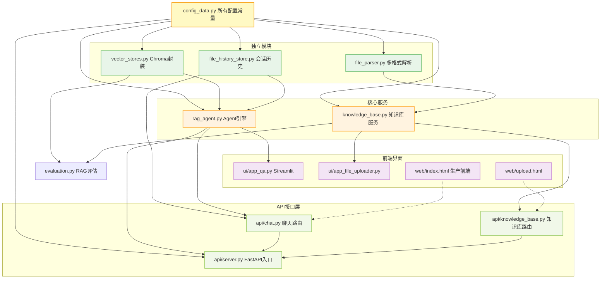

# RAG 模块依赖关系

```mermaid
flowchart TD
  config["config_data.py 所有配置常量"]

  subgraph L1["独立模块"]
    fp["file_parser.py 多格式解析"]
    hs["file_history_store.py 会话历史"]
    vs["vector_stores.py Chroma封装"]
  end

  subgraph L2["核心服务"]
    kb["knowledge_base.py 知识库服务"]
    rag["rag_agent.py Agent引擎"]
  end

  subgraph L3["API接口层"]
    server["api/server.py FastAPI入口"]
    api_chat["api/chat.py 聊天路由"]
    api_kb["api/knowledge_base.py 知识库路由"]
  end

  subgraph L4["前端界面"]
    ui_qa["ui/app_qa.py Streamlit"]
    ui_up["ui/app_file_uploader.py"]
    web_idx["web/index.html 生产前端"]
    web_up["web/upload.html"]
  end

  eval["evaluation.py RAG评估"]

  config --> fp & vs & hs & kb & rag & server
  fp --> kb
  vs --> rag & eval
  hs --> rag & api_chat
  kb --> api_kb & ui_up & eval
  rag --> api_chat & server & ui_qa
  api_chat --> server
  api_kb --> server
  web_idx -.-> api_chat
  web_up -.-> api_kb

  classDef config fill:#FFF9C4,stroke:#F9A825,stroke-width:2px
  classDef L1 fill:#E8F5E9,stroke:#81C784,stroke-width:2px
  classDef L2 fill:#FFF3E0,stroke:#FFB74D,stroke-width:2px
  classDef L3 fill:#F1F8E9,stroke:#9CCC65,stroke-width:2px
  classDef L4 fill:#F3E5F5,stroke:#CE93D8,stroke-width:2px
  class config config
  class fp,hs,vs L1
  class kb,rag L2
  class server,api_chat,api_kb L3
  class ui_qa,ui_up,web_idx,web_up L4
```
